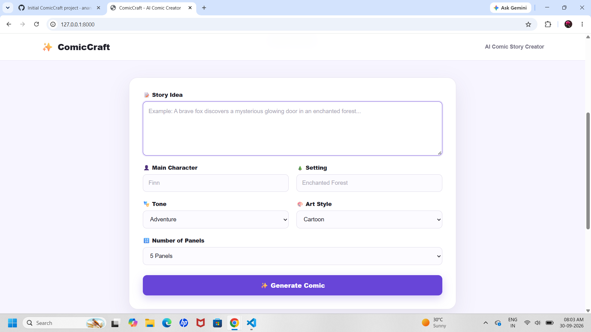
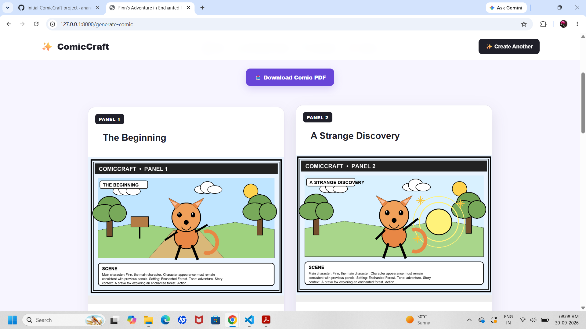

# ✨ ComicCraft

### AI-Powered Comic Story Creator

ComicCraft is a web-based AI comic creation platform that transforms a simple story idea into a structured visual comic.

Users provide a story idea, main character, setting, tone, art style, and number of panels. ComicCraft generates a storyboard, creates visual comic panels, displays the completed comic in a web interface, and exports it as a PDF.

---

## 🚀 Features

### ✍️ AI Storytelling

Transforms a simple story idea into a structured multi-panel storyline containing:

* Panel title
* Scene description
* Narration
* Character dialogue
* Image prompt

### 🎨 Comic Artwork

Creates a visual illustration for each comic panel.

The application supports:

* Cartoon
* Anime
* Comic Book
* Watercolor
* Cinematic

### 📖 Storyboard Generation

Users can choose between:

* 3 panels
* 4 panels
* 5 panels
* 6 panels
* 7 panels
* 8 panels

Each panel follows the story progression.

### 🌐 Web Comic Viewer

The generated comic is displayed as a clean web page containing:

* Comic title
* Story description
* Character
* Setting
* Tone
* Art style
* Individual comic panels
* Scene
* Narration
* Dialogue

### 📥 PDF Export

The completed comic can be exported as a PDF containing the generated story panels and artwork.

### ⚡ Local Fallback

ComicCraft can operate without an external AI image-generation API by using a local image-generation fallback for comic panel illustrations.

---

# 🏗️ Architecture

```text
                    ┌─────────────────────┐
                    │     User Input      │
                    │ Story + Character   │
                    │ Setting + Style     │
                    └──────────┬──────────┘
                               │
                               ▼
                    ┌─────────────────────┐
                    │    FastAPI Server    │
                    └──────────┬──────────┘
                               │
                               ▼
                    ┌─────────────────────┐
                    │  Story Generation   │
                    │      Service        │
                    └──────────┬──────────┘
                               │
                               ▼
                    ┌─────────────────────┐
                    │     Storyboard      │
                    │       Panels        │
                    └──────────┬──────────┘
                               │
                               ▼
                    ┌─────────────────────┐
                    │   Image Service     │
                    │ AI / Local Fallback │
                    └──────────┬──────────┘
                               │
                               ▼
                    ┌─────────────────────┐
                    │   Comic Web Page    │
                    └──────────┬──────────┘
                               │
                               ▼
                    ┌─────────────────────┐
                    │     PDF Export      │
                    └─────────────────────┘
```

---

# 🛠️ Technology Stack

| Component            | Technology                             |
| -------------------- | -------------------------------------- |
| Backend              | FastAPI                                |
| Programming Language | Python                                 |
| Frontend             | HTML, CSS, JavaScript                  |
| Templates            | Jinja2                                 |
| AI Text Generation   | Google Gemini                          |
| Image Generation     | Gemini / Hugging Face / Local fallback |
| Image Processing     | Pillow                                 |
| PDF Generation       | fpdf2                                  |
| Data Validation      | Pydantic                               |
| Testing              | Pytest                                 |
| Server               | Uvicorn                                |

---

# 📁 Project Structure

```text
ComicCraft/
│
├── app/
│   ├── __init__.py
│   ├── main.py
│   ├── config.py
│   ├── schemas.py
│   ├── exporters.py
│   ├── gemini_flash.py
│   ├── image_generator.py
│   │
│   ├── services/
│   │   ├── __init__.py
│   │   ├── story_service.py
│   │   ├── image_service.py
│   │   └── pdf_service.py
│   │
│   ├── templates/
│   │   ├── index.html
│   │   └── comic.html
│   │
│   └── static/
│       ├── css/
│       │   └── style.css
│       └── js/
│           └── app.js
│
├── generated/
│   ├── images/
│   └── comics/
│
├── tests/
│   └── test_app.py
│
├── .env.example
├── .gitignore
├── requirements.txt
└── README.md
```

---

# ⚙️ Installation

## 1. Clone or download the project

Open PowerShell inside the project directory:

```powershell
cd C:\Users\anand\ComicCraft
```

---

## 2. Create a virtual environment

```powershell
python -m venv venv
```

Activate it:

```powershell
.\venv\Scripts\Activate.ps1
```

---

## 3. Install dependencies

```powershell
pip install -r requirements.txt
```

---

# 🔑 Configuration

Create a `.env` file in the project root if API-based AI generation is required.

Example:

```env
GEMINI_API_KEY=your_api_key_here

GEMINI_TEXT_MODEL=gemini-2.5-flash

GEMINI_IMAGE_MODEL=gemini-2.5-flash-image

IMAGE_PROVIDER=local
```

Do not commit the `.env` file to Git.

The provided `.gitignore` excludes it from version control.

---

# ▶️ Running the Application

From the project root:

```powershell
uvicorn app.main:app --reload
```

Open the application in your browser:

```text
http://127.0.0.1:8000
```

---

# 🧪 Running Tests

Set the Python path in PowerShell:

```powershell
$env:PYTHONPATH = (Get-Location).Path
```

Then run:

```powershell
pytest -q
```

---

# 🔄 Application Workflow

```text
1. User enters story idea
             ↓
2. User selects character and setting
             ↓
3. User selects tone and art style
             ↓
4. User selects number of panels
             ↓
5. Storyboard is generated
             ↓
6. Image is created for each panel
             ↓
7. Comic is displayed in browser
             ↓
8. Comic is exported as PDF
```

---

# 🎯 Example

### Input

**Story Idea**

> A brave fox discovers a mysterious glowing door in an enchanted forest and goes on an adventure to uncover its secret.

**Character**

```text
Finn
```

**Setting**

```text
Enchanted Forest
```

**Tone**

```text
Adventure
```

**Art Style**

```text
Cartoon
```

**Panels**

```text
5
```

### Output

ComicCraft creates a multi-panel adventure containing:

1. The Beginning
2. A Strange Discovery
3. The Challenge
4. The Turning Point
5. The Resolution

The resulting comic can be viewed online and exported as a PDF.

---

# 🔐 Security Notes

* API keys should be stored in `.env`.
* `.env` should never be committed to Git.
* Generated files are stored separately from application source code.
* External AI services should only be enabled when the required credentials are configured.

---

# 🧩 Future Enhancements

Possible future improvements include:

* User accounts
* Comic history
* More art styles
* Character consistency across panels
* Custom panel layouts
* Individual panel image downloads
* Shareable comic links
* Cloud storage
* Advanced AI image generation
* Voice-based story input
* Multi-language comic generation

---

# 👩‍💻 Project

**ComicCraft — AI-Powered Comic Story Creator**

Built using Python, FastAPI, Generative AI, HTML, CSS and JavaScript.

````

After saving, run:

```powershell
Get-ChildItem README.md
````

If it shows the file, **README setup is done ✅**

### Next

Then we'll do the **final code cleanup**: check `main.py`, `config.py`, services, empty files, and test files so there are no unnecessary/dead files before calling the project complete.
 
 ## 📸 Screenshots

### 🏠 ComicCraft Generator



### 🎨 Generated Comic



## 📄 Demo PDF

[📥 Download Sample Comic PDF](docs/demo/ComicCraft-Demo.pdf)